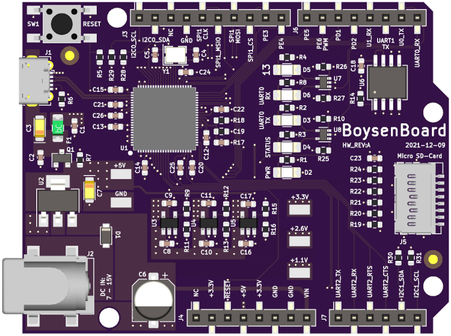

# BoysenBoard
Linux capable single board computer using the F1C200s in an Arduino form-factor.



## Build
The BoysenBoard supports booting from the on-board 16MB of SPI flash or from a 
Micro-SD card. The board will first try to boot from the SD card. If that 
fails, it will try the SPI flash. Otherwise it will enter FEL bootloader mode. 

### Setting up the Buildroot Environment
Clone this repo:
```
git clone https://github.com/mclewell/boysenboard
git submodule update --init
```
Change to the Buildroot directory:
```
cd boysenboard/software/buildroot
```

### Building the SPI Flash Image
We will be doing an out-of-tree build. Make an directory for the output:
```
mkdir output-spi
cd output-spi
```
Set-up the build:
```
make -C ../ O=$(pwd) BR2_EXTERNAL=$PWD/../../ boysenboard_spi_defconfig
```
Start the build (on my Ryzen 3900X this took about 7mins):
```
make
```
Once complete, the resulting flash image will be at:
```
images/flash.bin
```
To flash images into the SPI flash, the board must be in FEL mode. If the SPI 
flash is blank, the board will automatically enter FEL mode. If a valid boot 
image already exists in the flash, the board can be placed into FEL mode using
a special SD-Card image.
```
wget https://github.com/linux-sunxi/sunxi-tools/raw/master/bin/fel-sdboot.sunxi
dd if=fel-sdboot.sunxi of=/dev/sdX bs=1024 seek=8
```
Note: ensure the board is fully powered down. Sometimes external USB-UART cables
will back-power the board.

Insert the FEL SD-Card and connect the USB cable. FEL mode can be verified by 
using ```lsusb```:
```
Bus 005 Device 010: ID 1f3a:efe8 Allwinner Technology sunxi SoC OTG connector in FEL/flashing mode
```
Start the flashing process with:
```
sudo host/bin/sunxi-fel -p spiflash-write 0 images/flash.bin
```
This process will take about 3mins. Once complete, remove the USB cable and 
SD-Card. Connect to the serial console on UART0 to see console output messages.

The first boot after flashing a new image will take a while as U-Boot sets up 
the UBIFS. Subsequent boots will be much fast. You will see the following 
messages from U-Boot while this occurs:
```
...
SF: Detected w25q128 with page size 256 Bytes, erase size 64 KiB, total 16 MiB
ubi0: attaching mtd2
ubi0: scanning is finished
ubi0: attached mtd2 (name "rootubi", size 15 MiB)
ubi0: PEB size: 65536 bytes (64 KiB), LEB size: 65408 bytes
ubi0: min./max. I/O unit sizes: 1/256, sub-page size 1
ubi0: VID header offset: 64 (aligned 64), data offset: 128
ubi0: good PEBs: 252, bad PEBs: 0, corrupted PEBs: 0
ubi0: user volume: 5, internal volumes: 1, max. volumes count: 128
ubi0: max/mean erase counter: 0/0, WL threshold: 4096, image sequence number: 1562368489
ubi0: available PEBs: 12, total reserved PEBs: 240, PEBs reserved for bad PEB handling: 0
...
```

Once booted, the login information is:
```
User: root
Password: [none]
```
The SPI flash image also sets the board up as a USB Gadget presenting the host
computer with a serial COM port device and USB mass storage. The serial port
typically enumerates as /dev/ttyACM0. 

### Building the SD Card Image
Like the SPI image,  we will be doing an out-of-tree build. Make an directory 
for the output:
```
mkdir output-sd
cd output-sd
```
Set-up the build:
```
make -C ../ O=$(pwd) BR2_EXTERNAL=$PWD/../../ boysenboard_sd_defconfig
```
Start the build (on my Ryzen 3900X this took about 7mins):
```
make
```
Once complete, the resulting SD-Card image will be at:
```
images/sdcard.img
```
Write the image to an SD-Card:
```
sudo dd if=image/sdcard.img of=/dev/sdX bs=1M status=progress && sync
```
Note: the SD-Card image does not enable the USB Gadget feature.

# Acknowledgements
This project is derived from [George Hillard's busiesscard-linux](https://github.com/thirtythreeforty/businesscard-linux)
project. 

Also thanks to [Icenowy](https://github.com/Icenowy) for their work getting U-Boot and Linux running
on the F1C100s and F1C200s processors.
